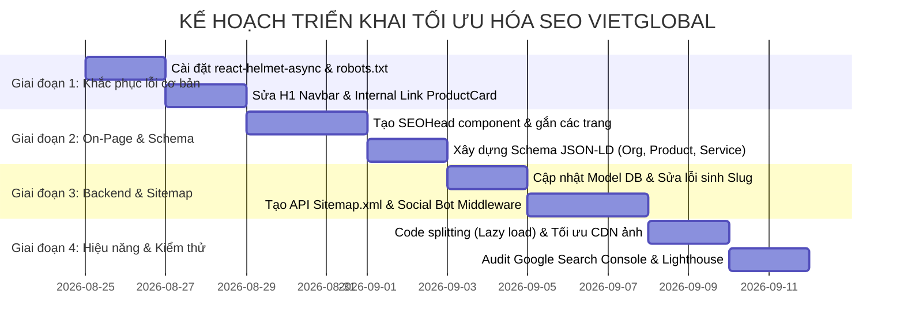

# BÁO CÁO TOÀN DIỆN VỀ ĐÁNH GIÁ VÀ KẾ HOẠCH TỐI ƯU HÓA SEO (FRONTEND & BACKEND) - DỰ ÁN VIETGLOBAL

> **Đơn vị thực hiện:** Nhóm Kỹ thuật & Phát triển VietGlobal  
> **Dự án:** Hệ thống Website & Cổng Dịch vụ VietGlobal (Logistics & Thương mại)  
> **Thời gian đánh giá:** Tháng 08/2026  
> **Phiên bản:** 1.0 - Bản chuẩn dành cho Báo cáo Cấp quản lý & Đội ngũ Kỹ thuật  

---

## 📑 MỤC LỤC

1. [TỔNG QUAN VÀ TÓM TẮT ĐÁNH GIÁ (EXECUTIVE SUMMARY)](#1-tổng-quan-và-tóm-tắt-đánh-giá-executive-summary)
2. [MA TRẬN VẤN ĐỀ & MỨC ĐỘ ƯU TIÊN (PRIORITY MATRIX)](#2-ma-trận-vấn-đề--mức-độ-ưu-tiên-priority-matrix)
3. [PHÂN TÍCH CHI TIẾT TỪNG VẤN ĐỀ VÀ GIẢI PHÁP KỸ THUẬT](#3-phân-tích-chi-tiết-từng-vấn-đề-và-giải-pháp-kỹ-thuật)
   - [3.1. Thẻ Meta Động & Quản lý Head (Dynamic Meta Tags)](#31-thẻ-meta-động--quản-lý-head-dynamic-meta-tags)
   - [3.2. Khả năng Thu thập Dữ liệu & Liên kết Nội bộ (Internal Links & Crawlability)](#32-khả-năng-thu-thập-dữ-liệu--liên-kết-nội-bộ-internal-links--crawlability)
   - [3.3. Sơ đồ Trang web & Tệp chỉ dẫn Bot (Sitemap.xml & Robots.txt)](#33-sơ-đồ-trang-web--tệp-chỉ-dẫn-bot-sitemapxml--robotstxt)
   - [3.4. Cấu trúc Tiêu đề & Ngữ nghĩa HTML (Heading Hierarchy & Semantics)](#34-cấu-trúc-tiêu-đề--ngữ-nghĩa-html-heading-hierarchy--semantics)
   - [3.5. Dữ liệu có cấu trúc (Schema.org / JSON-LD Structured Data)](#35-dữ-liệu-cấu-trúc-schemaorg--json-ld-structured-data)
   - [3.6. SEO Đa ngôn ngữ (i18n & Hreflang Tags)](#36-seo-đa-ngôn-ngữ-i18n--hreflang-tags)
   - [3.7. Chia sẻ Mạng Xã Hội (OpenGraph & Social Crawlers Pre-rendering)](#37-chia-sẻ-mạng-xã-hội-opengraph--social-crawlers-pre-rendering)
   - [3.8. Cơ sở dữ liệu & Xử lý Backend (Database Schema & Slug Generation)](#38-cơ-sở-dữ-liệu--xử-lý-backend-database-schema--slug-generation)
   - [3.9. Hiệu năng & Chỉ số Trải nghiệm Người dùng (Core Web Vitals)](#39-hiệu-năng--chỉ-số-trải-nghiệm-người-dùng-core-web-vitals)
4. [KẾ HOẠCH TRIỂN KHAI CHI TIẾT (ACTION PLAN & ROADMAP)](#4-kế-hoạch-triển-khai-chi-tiết-action-plan--roadmap)
5. [BỘ CHỈ SỐ NGHIỆM THU (KPIS & ACCEPTANCE CRITERIA)](#5-bộ-chỉ-số-nghiệm-thu-kpis--acceptance-criteria)

---

## 1. TỔNG QUAN VÀ TÓM TẮT ĐÁNH GIÁ (EXECUTIVE SUMMARY)

### 1.1. Bối cảnh
Website **VietGlobal** được xây dựng nhằm cung cấp dịch vụ logistics (đường biển, đường bộ, hàng không, hải quan, tuyến Trung - Việt) và phân phối/thương mại sản phẩm. Kiến trúc công nghệ hiện tại:
- **Frontend:** React 19 + Vite (Single Page Application - CSR), React Router v7, Redux Toolkit, i18next, Ant Design.
- **Backend:** Node.js Express v5, MongoDB (Mongoose), Cloudinary CDN.

### 1.2. Hiện trạng SEO
Sau khi rà soát toàn bộ source code của cả hai tầng Frontend và Backend, nhóm kỹ thuật xác định website đang gặp **nhiều lỗ hổng SEO nghiêm trọng**. Mặc dù giao diện người dùng được thiết kế đẹp mắt, các công cụ tìm kiếm (Google, Bing) và các nền tảng mạng xã hội (Facebook, Zalo) **gần như không thể thu thập và hiển thị dữ liệu chính xác**.

### 1.3. Bảng tóm tắt chỉ số hiện tại
| Chỉ số đánh giá | Hiện trạng | Mục tiêu sau tối ưu | Đánh giá mức độ |
| :--- | :---: | :---: | :---: |
| **Google Lighthouse SEO Score** | **~40 / 100** | **95 - 100 / 100** | 🔴 Nghiêm trọng |
| **Tiêu đề trang (Title Tags)** | 100% trang cố định "VietGlobal" | 100% trang có Title động theo từ khóa | 🔴 Nghiêm trọng |
| **Thẻ mô tả (Meta Descriptions)** | Không có (0%) | 100% trang có mô tả chuẩn 150-160 ký tự | 🔴 Nghiêm trọng |
| **Khả năng hiển thị khi chia sẻ Zalo/FB** | Trắng ảnh, mất tiêu đề con | Đầy đủ ảnh đại diện, tiêu đề, tóm tắt | 🔴 Nghiêm trọng |
| **Tệp Robots.txt & Sitemap.xml** | Không có (0%) | Đầy đủ `robots.txt` và `sitemap.xml` tự động | 🔴 Nghiêm trọng |
| **Internal Linking (Thu thập link)** | Thẻ `div onClick` (Bot không đọc được) | Dùng thẻ `<Link to>` / `<a href>` chuẩn | 🔴 Nghiêm trọng |
| **Thẻ H1 hợp lệ** | Bị lỗi (H1 nằm ở Header mọi trang) | Mỗi trang 1 thẻ H1 duy nhất đại diện | 🟠 Cao |
| **Dữ liệu cấu trúc Schema.org** | Không có (0 Schema) | Có Organization, Product, Service, Breadcrumb | 🟠 Cao |
| **Thẻ Đa ngôn ngữ (Hreflang)** | Không có | Có đầy đủ `hreflang="vi"`, `"en"`, `"x-default"` | 🟠 Cao |

---

## 2. MA TRẬN VẤN ĐỀ & MỨC ĐỘ ƯU TIÊN (PRIORITY MATRIX)

```
+-----------------------------------------------------------------------------------+
| MỨC ĐỘ        | MÃ VẤN ĐỀ | TÊN VẤN ĐỀ VÀ PHẠM VI ẢNH HƯỞNG                       |
+-----------------------------------------------------------------------------------+
| 🔴 CRITICAL   | ISSUE-01  | Thiếu Dynamic Meta Head: Toàn bộ trang chung 1 Title  |
|               | ISSUE-02  | Internal Linking dùng 'div onClick' làm Bot mất dấu   |
|               | ISSUE-03  | Không có file robots.txt và sitemap.xml               |
|               | ISSUE-04  | Mạng xã hội (FB, Zalo) không render được OpenGraph    |
|               | ISSUE-05  | Lỗi Backend: Sinh slug tiếng Việt thiếu dấu & trùng   |
+-----------------------------------------------------------------------------------+
| 🟠 HIGH       | ISSUE-06  | Thẻ H1 bị đặt sai vị trí (nằm trong Navbar logo)      |
|               | ISSUE-07  | Thiếu dữ liệu có cấu trúc (Schema.org / JSON-LD)      |
|               | ISSUE-08  | Đa ngôn ngữ thiếu thẻ Hreflang & <html lang> tĩnh     |
|               | ISSUE-09  | Backend Model thiếu các trường dữ liệu cho SEO        |
+-----------------------------------------------------------------------------------+
| 🟡 MEDIUM     | ISSUE-10  | Font nhúng động qua JS gây giật layout (CLS/LCP)      |
|               | ISSUE-11  | Routes tải đồng bộ (chưa áp dụng Code Splitting Lazy) |
|               | ISSUE-12  | Trùng lặp đường dẫn (2 trang About Us, 3 trang Home)  |
+-----------------------------------------------------------------------------------+
```

---

## 3. PHÂN TÍCH CHI TIẾT TỪNG VẤN ĐỀ VÀ GIẢI PHÁP KỸ THUẬT

---

### 3.1. Thẻ Meta Động & Quản lý Head (Dynamic Meta Tags)

#### A. Vấn đề thực tế
- File `frontend/index.html` chỉ chứa:
  ```html
  <title>VietGlobal</title>
  ```
- Toàn bộ source code Frontend không có bất kỳ logic nào để thay đổi `document.title` hay chèn `<meta name="description">` khi người dùng chuyển sang các trang:
  - Chi tiết sản phẩm: `/vi/product-detail/:slug`
  - Dịch vụ: `/vi/service/sea-freight`
  - Danh mục: `/vi/category/:slug`
  - Giới thiệu, Liên hệ, Chính sách...
- **Hậu quả:** Tất cả các trang con khi lên Google đều chỉ hiển thị đúng chữ **"VietGlobal"**, không có mô tả (snippet), CTR (tỷ lệ nhấp) sẽ cực thấp và Google đánh giá là trang rác do trùng lặp tiêu đề hàng loạt (Duplicate Title Tags).

#### B. Giải pháp kỹ thuật
1. Cài đặt thư viện **`react-helmet-async`**:
   ```bash
   npm install react-helmet-async
   ```
2. Bọc `HelmetProvider` ở `frontend/src/main.jsx`.
3. Xây dựng component dùng chung `SEOHead.jsx` để tự động render tiêu đề, mô tả, từ khóa, canonical URL, OpenGraph theo từng trang và theo từng ngôn ngữ.

---

### 3.2. Khả năng Thu thập Dữ liệu & Liên kết Nội bộ (Internal Links & Crawlability)

#### A. Vấn đề thực tế
- Trong `frontend/src/components/ProductCard/ProductCard.jsx` (dòng 27) và `ProductCard2.jsx` (dòng 34):
  ```jsx
  // HIỆN TẠI (SAI NGUYÊN TẮC SEO):
  <Card hoverable onClick={handleProductDt}> ... </Card>
  // hoặc
  <div className="product-card" onClick={() => handleProductDt()}> ... </div>
  ```
- **Hậu quả:** Googlebot và các công cụ tìm kiếm **chỉ thu thập liên kết thông qua thẻ `<a href="...">`**. Chúng không thực thi các sự kiện click JavaScript `onClick={() => navigate(...)}` trên thẻ `<div>`/`<Card>`. Do đó, bot tìm kiếm **không thể đi từ trang danh sách sản phẩm hoặc trang chủ vào các trang chi tiết sản phẩm**, khiến hàng loạt trang sản phẩm bị coi là "Orphan Pages" (trang mồ côi, không có liên kết trỏ tới).

#### B. Giải pháp kỹ thuật
Chuyển toàn bộ bọc ngoài của các Card sản phẩm, thẻ danh mục sang thẻ `<Link>` của `react-router-dom`:
```jsx
// ĐÃ SỬA (CHUẨN SEO):
import { Link } from 'react-router-dom';

<Link 
  to={`/${currentLang}/product-detail/${slug}`} 
  className="product-card-link"
  style={{ textDecoration: 'none', color: 'inherit' }}
>
  <Card hoverable>
    {/* Nội dung card */}
  </Card>
</Link>
```

---

### 3.3. Sơ đồ Trang web & Tệp chỉ dẫn Bot (Sitemap.xml & Robots.txt)

#### A. Vấn đề thực tế
- Thư mục `frontend/public/` chỉ có duy nhất file `vite.svg`. Không có `robots.txt` và `sitemap.xml`.
- Backend Express không có router `/sitemap.xml`.
- **Hậu quả:** Search engine không biết những trang nào được phép cào, những trang nào bị cấm (như `/admin`, `/login`, `/signup`), và không có danh sách URL tổng hợp để lập chỉ mục hàng loạt.

#### B. Giải pháp kỹ thuật
1. **Tạo `frontend/public/robots.txt`:**
   ```txt
   User-agent: *
   Allow: /
   Disallow: /admin/
   Disallow: /login
   Disallow: /signup
   Disallow: /api/

   Sitemap: https://vietglobal.com/sitemap.xml
   ```
2. **Xây dựng Endpoint Dynamic Sitemap trên Backend (`backend/src/controller/seo.controller.js`):**
   - Tự động query tất cả Category và Product từ MongoDB.
   - Kết hợp danh sách các trang tĩnh (Home, Logistics, About Us, Services, Contact, Policy).
   - Xuất XML chuẩn định dạng của Google Sitemap Protocol với đủ 2 phiên bản ngôn ngữ `/vi/...` và `/en/...`.

---

### 3.4. Cấu trúc Tiêu đề & Ngữ nghĩa HTML (Heading Hierarchy & Semantics)

#### A. Vấn đề thực tế
1. **Lỗi `<h1>` trên toàn bộ website:** 
   Tại file `frontend/src/components/Navbar/Navbar.jsx` (dòng 170):
   ```jsx
   <Link className="logo-container-nav" to={`/${lang}/`}>
     
     <h1 className="logo-text">VietGlobal</h1> {/* <-- SAI! */}
   </Link>
   ```
   Do Navbar xuất hiện trên 100% các trang, dẫn đến **mọi trang đều có thẻ H1 là "VietGlobal"** thay vì tiêu đề nội dung của trang đó.
2. **Trang danh mục sản phẩm (`ProductCategory.jsx`)** dùng thẻ `<p className="product-list-title-cate">` thay vì `<h1>`.
3. **Trang chủ (`HomePage.jsx`)** dùng `<h2>` cho tiêu đề chính, không có thẻ `<h1>`.
4. **Card sản phẩm (`ProductCard2.jsx`)** dùng thẻ `<h5>`, gây nhảy bậc cấu trúc (từ `<h1>` nhảy cóc sang `<h5>`, thiếu `<h2>`, `<h3>`).

#### B. Giải pháp kỹ thuật
1. Sửa `Navbar.jsx`: Thay `<h1 className="logo-text">` thành `<span className="logo-text">`.
2. Đảm bảo nguyên tắc: **Mỗi trang chỉ có duy nhất 1 thẻ `<h1>`** thể hiện nội dung chính của trang đó:
   - Trang chủ: `<h1 className="sr-only">VietGlobal - Dịch Vụ Vận Tải Quốc Tế & Thương Mại</h1>`
   - Trang chi tiết sản phẩm: `<h1 className="product-title">{product.title[lang]}</h1>`
   - Trang dịch vụ: `<h1 className="service-title">{t(service.title)}</h1>`
   - Trang danh mục: `<h1 className="category-title">{t('productByCate')} {categoryName}</h1>`
3. Chuẩn hóa tiêu đề trong các Card danh sách thành thẻ `<h3>` hoặc `<h4>`.

---

### 3.5. Dữ liệu có cấu trúc (Schema.org / JSON-LD Structured Data)

#### A. Vấn đề thực tế
- Hiện tại website chưa có bất kỳ đoạn mã JSON-LD nào.
- **Hậu quả:** Mất cơ hội hiển thị Rich Snippets (ngôi sao đánh giá, giá tiền, logo thương hiệu, breadcrumb phân cấp, thông tin liên hệ công ty) trên trang nhất tìm kiếm Google.

#### B. Giải pháp kỹ thuật
Xây dựng helper tạo Schema JSON-LD và nhúng động vào `SEOHead.jsx`:
1. **Schema Organization (Doanh nghiệp VietGlobal):**
   ```json
   {
     "@context": "https://schema.org",
     "@type": "LogisticsService",
     "name": "VietGlobal Logistics",
     "url": "https://vietglobal.com",
     "logo": "https://vietglobal.com/logo.png",
     "contactPoint": {
       "@type": "ContactPoint",
       "telephone": "+84-xxx-xxx-xxx",
       "contactType": "customer service",
       "areaServed": ["VN", "CN"],
       "availableLanguage": ["Vietnamese", "English"]
     },
     "address": {
       "@type": "PostalAddress",
       "addressCountry": "VN"
     }
   }
   ```
2. **Schema Product (Cho trang Chi tiết sản phẩm):**
   Cung cấp tên, hình ảnh, mô tả, giá tiền (`offers: { price, priceCurrency: "VND" }`), tình trạng còn hàng.
3. **Schema Service (Cho trang Dịch vụ Vận tải):**
   Cung cấp `serviceType` (Sea Freight, Air Freight, Customs Clearance, Trucking).
4. **Schema BreadcrumbList (Đường dẫn phân cấp):**
   Giúp Google hiển thị thanh điều hướng dạng `vietglobal.com > Sản phẩm > Tên sản phẩm` thay vì URL thô.

---

### 3.6. SEO Đa ngôn ngữ (i18n & Hreflang Tags)

#### A. Vấn đề thực tế
1. `index.html` bị cố định `<html lang="en">`, không đổi khi URL là `/vi/...`.
2. Thiếu toàn bộ thẻ `hreflang` chỉ dẫn ngôn ngữ tương ứng:
   - Google không biết rằng trang `/vi/product-detail/san-pham-a` và `/en/product-detail/product-a` là cùng một nội dung nhưng ở hai thứ tiếng khác nhau.
3. Điều hướng gốc tại `App.jsx` tự động chuyển mọi người dùng vào `/en` (`<Navigate to="/en" replace />`) thay vì xác định ngôn ngữ mặc định phù hợp (VD: người dùng Việt Nam nên vào `/vi`).

#### B. Giải pháp kỹ thuật
1. Trong component `SEOHead.jsx`, cập nhật thẻ `<html>`:
   ```javascript
   document.documentElement.lang = currentLang;
   ```
2. Thêm các thẻ `link alternate hreflang` tương ứng:
   ```html
   <link rel="alternate" hreflang="vi" href="https://vietglobal.com/vi/product-detail/slug-vi" />
   <link rel="alternate" hreflang="en" href="https://vietglobal.com/en/product-detail/slug-en" />
   <link rel="alternate" hreflang="x-default" href="https://vietglobal.com/en/product-detail/slug-en" />
   ```

---

### 3.7. Chia sẻ Mạng Xã Hội (OpenGraph & Social Crawlers Pre-rendering)

#### A. Vấn đề thực tế
- Kiến trúc Vite SPA chỉ trả về file HTML rỗng `<div id="root"></div>`.
- Bot quét link của **Facebook (facebookexternalhit)** và **Zalo (ZaloBot)** **không thực thi JavaScript**. Khi ai đó gửi link một sản phẩm qua Zalo/Facebook, các bot này chỉ đọc file HTML rỗng ban đầu và không lấy được ảnh sản phẩm, tiêu đề hoặc mô tả.

#### B. Giải pháp kỹ thuật
Có 2 lớp giải pháp:
1. **Lớp 1 (Frontend):** Cấu hình thẻ OpenGraph động qua `react-helmet-async` (cho các bot có chạy JS nhẹ và trình duyệt người dùng).
2. **Lớp 2 (Backend Express Middleware):** 
   Tạo middleware `socialCrawler.middleware.js` trên Backend:
   - Nếu `User-Agent` là `facebookexternalhit`, `Facebot`, `ZaloBot`, `Twitterbot`, `LinkedInBot`:
   - Backend sẽ fetch thông tin sản phẩm/dịch vụ từ MongoDB và trả về trực tiếp đoạn HTML chứa các thẻ `<meta property="og:title">`, `<meta property="og:image">`, `<meta property="og:description">`.
   - Kết quả: Khi chia sẻ link trên Zalo/Facebook, banner thumbnail và tiêu đề hiển thị đầy đủ, sắc nét 100%.

---

### 3.8. Cơ sở dữ liệu & Xử lý Backend (Database Schema & Slug Generation)

#### A. Vấn đề thực tế
1. **Thiếu trường SEO trong Model:**
   Trong `product.model.js`, `category.model.js`, `about-us.model.js`:
   - Không có trường `metaTitle`, `metaDescription`, `metaKeywords`, `canonicalUrl`, `ogImage`.
   - Admin không thể tùy biến tiêu đề tìm kiếm khác với tiêu đề hiển thị.
2. **Lỗi sinh Slug tiếng Việt:**
   Trong `product.model.js` (dòng 40):
   ```javascript
   // HIỆN TẠI (LỖI):
   this.slug.vi = slugify(this.title.vi, { lower: true, strict: true });
   // THIẾU removeAccents -> các ký tự như 'đ', 'ă', 'ơ' có thể bị mất hoặc sinh slug không chuẩn.
   ```
3. **Lỗi trùng lặp Slug (Collision):**
   Nếu người dùng tạo 2 sản phẩm cùng tên, MongoDB sẽ throw lỗi `E11000 duplicate key error` làm sập API thay vì tự động sinh slug kiểu `ten-san-pham-1`, `ten-san-pham-2`.

#### B. Giải pháp kỹ thuật
1. **Cập nhật Schema:** Bổ sung các trường SEO metadata:
   ```javascript
   seo: {
     metaTitle: { vi: String, en: String },
     metaDescription: { vi: String, en: String },
     metaKeywords: { vi: String, en: String },
     ogImage: { type: String }
   }
   ```
2. **Sửa hook sinh slug & chống trùng lặp:**
   ```javascript
   productSchema.pre('save', async function (next) {
     if (this.isModified('title.vi') || this.isNew) {
       const cleanTitleVi = removeAccents(this.title.vi);
       let baseSlugVi = slugify(cleanTitleVi, { lower: true, strict: true });
       this.slug.vi = await generateUniqueSlug(this.constructor, 'slug.vi', baseSlugVi, this._id);
     }
     // Tương tự cho slug.en
     next();
   });
   ```

---

### 3.9. Hiệu năng & Chỉ số Trải nghiệm Người dùng (Core Web Vitals)

#### A. Vấn đề thực tế
1. **Font Loading gây chớp nháy (CLS/FOUT):**
   Trong `ServiceDetailPage.jsx` (dòng 74), Google Fonts được nạp động bằng cách tạo thẻ `<link>` trong `useEffect`. Việc này làm chậm thời gian hiển thị font chữ và gây giật layout.
2. **Hình ảnh chưa tối ưu:**
   Nhiều ảnh banner lấy trực tiếp từ web ngoài (`tpshipping.com.vn`), kích thước lớn, không có thuộc tính `loading="lazy"` và không có kích thước `width`, `height` cố định.
3. **Chưa áp dụng Code Splitting:**
   File `routes.js` import tĩnh toàn bộ 15 trang (bao gồm cả các trang nặng như Admin), khiến file bundle JS ban đầu bị phình to, kéo dài thời gian First Contentful Paint (FCP).

#### B. Giải pháp kỹ thuật
1. Chuyển nạp Google Fonts về `index.html` với thẻ `rel="preconnect"`:
   ```html
   <link rel="preconnect" href="https://fonts.googleapis.com" />
   <link rel="preconnect" href="https://fonts.gstatic.com" crossorigin />
   <link rel="preconnect" href="https://res.cloudinary.com" />
   ```
2. Tối ưu ảnh qua Cloudinary: Chèn tham số `f_auto,q_auto` tự động nén định dạng WebP/AVIF.
3. Chuyển `routes.js` sang sử dụng `React.lazy()` và `Suspense`:
   ```javascript
   const ProductDetailPage = React.lazy(() => import("../pages/ProductDetailPage/ProductDetailPage"));
   const AdminPageHome = React.lazy(() => import("../pages/Admin/AdminPageHome/AdminPageHome"));
   ```

---

## 4. KẾ HOẠCH TRIỂN KHAI CHI TIẾT (ACTION PLAN & ROADMAP)

Kế hoạch được chia làm **4 giai đoạn (Sprints)** rõ ràng để thuận tiện cho việc báo cáo tiến độ và nghiệm thu:



### 🗓️ Chi tiết từng giai đoạn:

### 🔹 GIAI ĐOẠN 1: Nền tảng Kỹ thuật & Sửa lỗi khẩn cấp (Ước tính: 3 - 4 ngày)
- [ ] Cài đặt thư viện `react-helmet-async` trên Frontend và cấu hình tại `main.jsx`.
- [ ] Tạo file `frontend/public/robots.txt` chuẩn cho phép bot và chỉ định Sitemap.
- [ ] Cập nhật `frontend/index.html`: Thêm meta viewport, preconnect font, sửa đường dẫn Favicon.
- [ ] Sửa thẻ `<h1>VietGlobal</h1>` trong `Navbar.jsx` thành `<span>`.
- [ ] Sửa sự kiện `onClick` của `ProductCard.jsx` và `ProductCard2.jsx` thành thẻ `<Link to="...">`.

### 🔹 GIAI ĐOẠN 2: On-Page SEO, Schema Structured Data & Đa ngôn ngữ (Ước tính: 4 - 5 ngày)
- [ ] Tạo component tái sử dụng `SEOHead.jsx` hỗ trợ đầy đủ Title, Description, Canonical, Hreflang, OpenGraph.
- [ ] Gắn `SEOHead` cho từng trang con: Trang chủ, Chi tiết sản phẩm, Dịch vụ vận chuyển, Danh mục, Giới thiệu, Liên hệ, Chính sách.
- [ ] Viết bộ helper `schemaGenerator.js` và nhúng Schema JSON-LD (`Organization`, `Product`, `Service`, `BreadcrumbList`).
- [ ] Rà soát và chuẩn hóa phân cấp Heading (`h1`, `h2`, `h3`) trên tất cả các trang.

### 🔹 GIAI ĐOẠN 3: Backend SEO, Tự động hóa Sitemap & Social Crawler (Ước tính: 4 - 5 ngày)
- [ ] Bổ sung các trường SEO metadata (`metaTitle`, `metaDescription`, `metaKeywords`, `ogImage`) vào MongoDB Models.
- [ ] Sửa hook `pre('save')` trong `product.model.js`: Bổ sung `removeAccents` và cơ chế chống trùng lặp Slug tự động.
- [ ] Viết Controller & Router `GET /sitemap.xml` trên Backend tự động trích xuất toàn bộ URL từ Database.
- [ ] Xây dựng Express Middleware nhận diện Social Bots để trả về OpenGraph tags trực tiếp.

### 🔹 GIAI ĐOẠN 4: Tối ưu Hiệu năng Core Web Vitals & Nghiệm thu (Ước tính: 3 - 4 ngày)
- [ ] Áp dụng Code Splitting (`React.lazy` và `Suspense`) trong `routes.js`.
- [ ] Tối ưu hóa toàn bộ hình ảnh qua CDN Cloudinary (`f_auto,q_auto`) và thêm `loading="lazy"`.
- [ ] Dọn dẹp các route trùng lặp (`/about-us` và `/shipping-about-us`).
- [ ] Chạy kiểm thử toàn diện trên **Google Lighthouse**, **Google Rich Results Test**, **Facebook/Zalo Sharing Debugger**.
- [ ] Khai báo và gửi `sitemap.xml` lên **Google Search Console**.

---

## 5. BỘ CHỈ SỐ NGHIỆM THU (KPIS & ACCEPTANCE CRITERIA)

Dưới đây là bảng tiêu chí đánh giá kết quả hoàn thành để báo cáo nghiệm thu:

| Hạng mục kiểm thử | Tiêu chuẩn nghiệm thu | Công cụ kiểm tra |
| :--- | :--- | :--- |
| **Điểm SEO Lighthouse** | Đạt từ **95 đến 100 điểm** | Google Chrome Lighthouse |
| **Tính hợp lệ của Schema** | Đạt **0 lỗi (Valid)** cho Organization, Product, Service, Breadcrumbs | [Google Rich Results Test](https://search.google.com/test/rich-results) |
| **Khả năng hiển thị Social** | Hiển thị chính xác Thumbnail, Title, Description của từng sản phẩm/dịch vụ | [Facebook Sharing Debugger](https://developers.facebook.com/tools/debug/) & Zalo Debugger |
| **Sitemap XML** | File `sitemap.xml` trả về mã HTTP 200, đúng cấu trúc XML, chứa đủ toàn bộ link sản phẩm | [Google Search Console](https://search.google.com/search-console) |
| **Internal Link Crawling** | 100% card sản phẩm và danh mục có thẻ `<a href>` hợp lệ | Screaming Frog / Ahrefs Crawler |
| **Hiệu năng tải trang** | LCP < 2.5s, CLS < 0.1, FID/INP < 100ms (Xanh Core Web Vitals) | PageSpeed Insights |

---

> 📌 **Tài liệu đính kèm:**  
> File báo cáo này đã được lưu trực tiếp vào thư mục gốc của dự án tại [`d:\VietGlobal\SEO_AUDIT_REPORT_VIETGLOBAL.md`](file:///d:/VietGlobal/SEO_AUDIT_REPORT_VIETGLOBAL.md) để đội ngũ thuận tiện theo dõi, chỉnh sửa và trình duyệt cấp quản lý.
